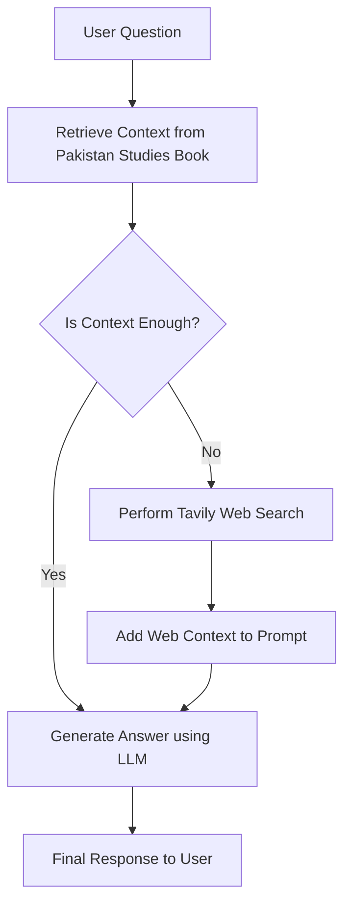

# 🇵🇰 Pakistan Studies RAG Chatbot

A Retrieval-Augmented Generation (RAG) based chatbot designed to answer questions about Pakistan Studies and History.

The chatbot retrieves information from a Pakistan Studies textbook and generates answers using an LLM. If the retrieved context is insufficient, the system automatically performs a web search using Tavily to gather the required information.


## 🚀 Features

### 📚 RAG-Based Question Answering
Retrieves relevant passages from a Pakistan Studies history book.

### 🌐 Automatic Web Search Fallback
If the local context is insufficient, the system performs a Tavily web search.

### 🧠 Context-Aware Responses
Answers are generated using retrieved information to reduce hallucinations.

### 📄 OCR for Scanned PDFs
Uses Tesseract OCR to extract text from scanned textbook pages.

### 🔎 Semantic Retrieval
Uses embeddings and a vector database to find the most relevant sections of the textbook.

## 🏗 System Architecture


## 🛠 Tech Stack

- Python + FastAPI (serverless)
- Pinecone — vector database + hosted inference embeddings
- Tavily Search API — web search fallback
- Groq — LLM inference
- LangChain Core — prompt templates
- Vanilla HTML/JS frontend

## 🏠 Deployment

### Vercel (current)

1. Set the following environment variables in the Vercel dashboard:
   - `GROQ_API_KEY`
   - `TAVILY_API_KEY`
   - `PINECONE_API_KEY`
   - `INDEX_NAME`
   - `HOST_NAME`

2. Deploy:
   ```bash
   vercel deploy
   ```

### Local development

```bash
pip install -r requirements.txt
uvicorn api.chat:app --reload
# Then open public/index.html in a browser (or serve with: python -m http.server 8080 -d public)
```

> **Note on embeddings:** The app previously used `sentence-transformers` locally.
> It now uses Pinecone's hosted `multilingual-e5-large` model via `pc.inference.embed`,
> which keeps the Vercel bundle well within the 250 MB limit.